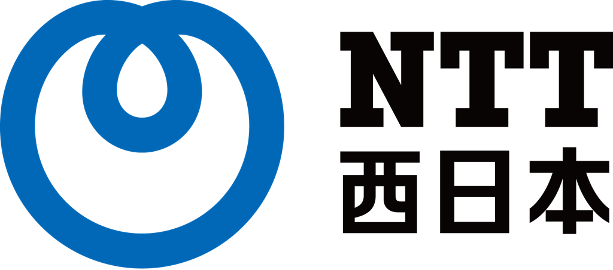
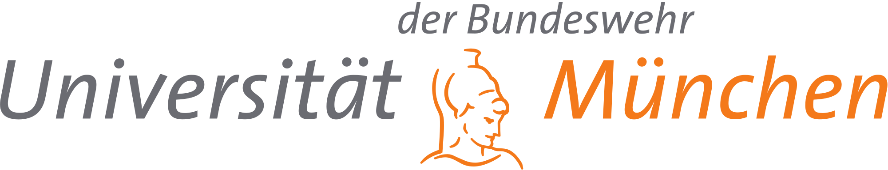
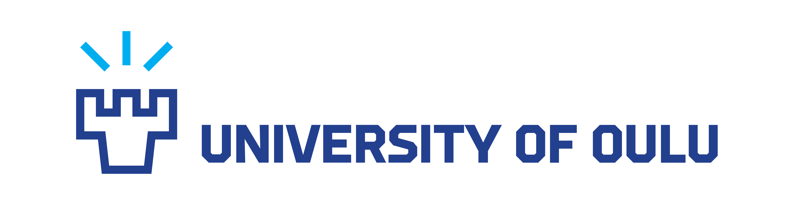

The first one-day workshop on Momentary Emotion Elicitation and Capture (MEEC) will take place on April 25th or 26th, 2020 at the [ACM CHI 2020 Conference](https://chi2020.acm.org/){:target="\_blank"} in Honolulu (Hawaii, USA).

## About

Recognizing human emotions and responding appropriately has the potential to radically change the way we interact with technology. However, to train machines to sensibly detect and recognize human emotions, we need valid emotion ground truths. We face a fundamental challenge concerning temporal resolution in emotion elicitation and measurement: even though emotions, whether microexpressions or bodily changes, are in continuous flux and can be measured, self-reports do not have the same temporal resolution. Several factors contribute to this temporal resolution mismatch: different awareness (interoception) levels across individuals; non-linearity in time perception; and how emotions themselves alter time perception (halo effects).

In this workshop, we address this challenge of Momentary Emotion Elicitation and Capture (MEEC) from individuals continuously and in real-time, without adversely affecting user experience. Specifically, in this first edition of the one-day CHI 2020 workshop, we will (a) explore and define novel elicitation tasks (b) survey sensing and annotation techniques (c) create a taxonomy of when and where to apply an elicitation method.

## How to Participate

We invite position papers, posters, and demos (2-8 pages, incl. references) that present emotion elicitation and/or capture methods. Submissions will be peer-reviewed by 2 peers, and selected on their potential to spark discussion. Submissions are single-blind (so please include author names as part of your submission). Submissions should be in the [SIGCHI Extended Abstracts](https://chi2020.acm.org/authors/chi-proceedings-format/){:target="\_blank"} format and submitted in PDF through [Easychair](https://easychair.org/conferences/?conf=meec2020){:target="\_blank"}. Accepted submissions will be made available on the workshop website. At least one author must register for the workshop and one day of the conference.

[Submit [EasyChair]](https://easychair.org/conferences/?conf=meec2020){: .btn .btn--warning}{:target="\_blank"}

## Organization

 &nbsp;
 &nbsp;
 &nbsp;
 &nbsp;  
 &nbsp;
 &nbsp;
 &nbsp;

List of organizers [here](committee).

## Contact

For any additional questions, please contact us at [aea@cwi.nl](mailto:aea@cwi.nl)
